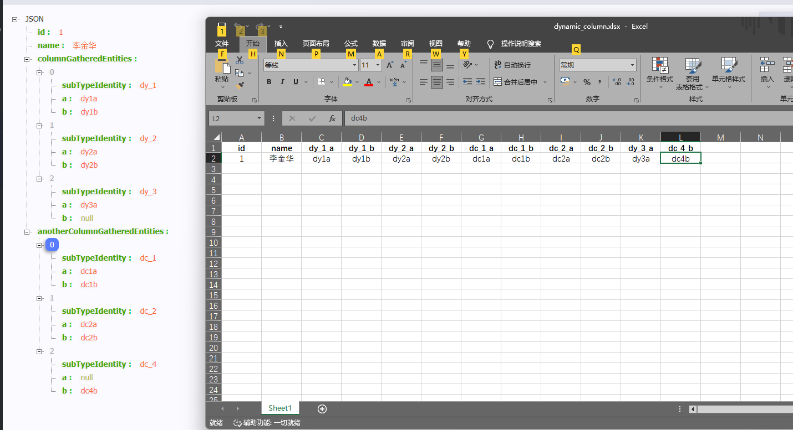
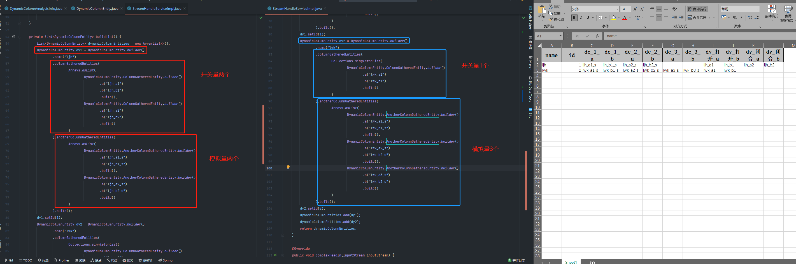
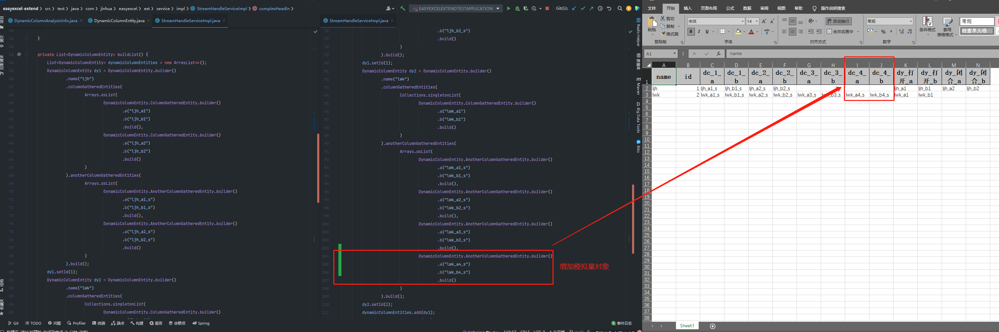

# easyexcel-extend

## 一、效果概览——两层父子引用关系下Excel的导入导出

### 1. 复杂对象与Excel对应效果

* 树形的内存对象与放平Excel对象


### 2. 多个复杂对象导出，Excel表头动态情况

* 不同的父对象，子对象的数量与字段null情况


* 对于被引用对象的数量，对整体Excel表头字段数量的影响


## 二、问题场景

### 1. 概述

#### 1) 业务的需求 
* 业务通过Excel导入导出的方式做配置工作，希望能将复杂引用关系对象，在Excel导出后展示在同一行（不另起Sheet页做引用关系），
以减小配置人员的配置难度。

#### 2) 问题初步分析
* 使用业务当前使用的EasyExcel组件，开发人员难以实现上述场景，或实现不优雅，或实现后维护度不高。
  * 如果是固定几组子对象的方式，那么业务一旦有数量变更要求，则需要更改EasyExcel对应的实体类。
    * 比如当前做的配置业务，会有30+子对象，每个对象按10个字段算，用EasyExcel现有方式去做，则EasyExcel对应的DTO对象，
对应原有引用的子对象中的字段数量也有300个！
  * 如果用EasyExcel支持的Map方式去做，导入导出都用Map，那么后续的维护性也是非常低的。

#### 3) 初步决策
* 基于提升开发效率的初衷，想封装一个组件，解决现有EasyExcel不支持的树形对象引用关系导入导出到同一行的对象转换问题。
* 由于多级对象实现实现会有一定的复杂度（EasyExcel可能会有考虑该功能，但可能囿于功能实现程度、复杂性、适用场景，不太好确定功能范围吧），
  * 我想先实现一个两层引用关系的Excel动态列功能。
  * 后续如果有需求，再将该功能通过递归方式编码，实现为多级引用对象的。

### 2. 案例说明

 * 内存中的复杂对象
   * 树形引用关系复杂
   * 有一定数量关系
```java
public class DynamicColumnEntity {

    private String name;

    /**
     * 引用另一个类型的对象
     */
    private List<ColumnGatheredEntity> columnGatheredEntities;
}

public class ColumnGatheredEntity {
    private String a;
    private String b;
}
```

* Excel中期待的效果
  * 父子对象都放平展示，类似于数据库二维表。
```java
public class DynamicColumnDTO {
    
    /**
     * 父对象属性
     */
    private String name;

    /**
     * 【多个子对象】的多个属性
     */
    private String sub1a;
    private String sub1b;
    
    private String sub2a;
    private String sub2b;
}
```

### 3. 问题点分析

#### 1) 当前项目使用的Excel组件是EasyExcel，是通过实体类和导出的数据按字段方式去实现的。即Excel导出多少列，类中就得有多少个字段。

```java
import com.alibaba.excel.annotation.ExcelProperty;

public class DynamicColumnEntity {

    @ExcelProperty(value = "name")
    private String name;
    
    @ExcelProperty(value = "age")
    private String age;
}
```
* 这种实现方式，是无法解决上述【引用子对象的数量】问题的。如果子对象有5个时，子对象就必须有5份数据在父对象中。数量关系是一个痛点。

#### 2) 当前项目中已用到EasyExcel的相关业务类，也需要增加子对象导出到同一个Excel中。
* 在这种现状下，为了减小对已有EasyExcel业务类的影响，我决定**复用EasyExcel的常用注解**，如@ExcelProperty.

## 三、组件的使用方式

### 1. 父层对象需要标注注解 @DynamicColumnAnalysis
* 代表该对象需要支持复杂引用对象Excel动态列

```java
@DynamicColumnAnalysis
public class DynamicColumnEntity {

    @ExcelProperty(value = "name")
    private String name;
}
```

* 可以支持继承关系，在其父类对象标注也是支持的

```java
public class DynamicColumnEntity extends BaseDynamicEntity {

    @ExcelProperty(value = "name")
    private String name;
}

@DynamicColumnAnalysis
abstract class BaseDynamicEntity {

    @ExcelProperty(value = "id")
    private Integer id;
}
```

### 2. 父对象中，被引用的集合类型子对象字段需要标识 @CollectionGathered

```java
@DynamicColumnAnalysis
public class DynamicColumnEntity {

    @ExcelProperty(value = "name")
    private String name;

    @CollectionGathered
    private Set<ColumnGatheredEntity> columnGatheredEntities;

    @CollectionGathered
    private List<AnotherColumnGatheredEntity> anotherColumnGatheredEntities;
}
```
* 当前支持的集合类型说明：
  * 若是Collection和List类型，则字段初始化时默认采用ArrayList；
  * 若是Set类型，则字段初始化时，默认采用LinkedHashSet来做，保证一定顺序。

### 3. 被引用的子对象类型

> 运行时引用的多个子对象及字段如何与Excel中相互识别对应？
* 目前定义的规则是【子对象类型】【子对象序号】【子对象字段】

#### 1) 子对象类型，@ColumnGatheredSubType标识它是被引用的子对象；
#### 2） 配合@ObjectIdentityStrategy注解，标识【子对象序号】的生成方式（自增、给定范围枚举）
#### 3) 子对象实现 _IColumnGatheredSubType_ 接口（导入动态解析时，需要识别多个Excel字段是否同属同一个子对象）

```java
@ColumnGatheredSubType(subTypeIdentity = "dy", separator = '_',
        objectIdentityStrategy = @ObjectIdentityStrategy(value = 2, objectIdentityRange = {"打开", "闭合"})
)
public static class ColumnGatheredEntity implements IColumnGatheredSubType {

    /**
     * 用作子对象识别标识
     */
    private transient String subTypeIdentity;

    @DynamicColumnAnalysis(subFieldIdentity = "a")
    private String a;
    @DynamicColumnAnalysis(subFieldIdentity = "b")
    private String b;
}
```

### 4. 导入时，使用提供的Excel默认读取监听器 DefaultMap2CustomEntityListener

* 该类支持继承，一般会重写Excel表头行号的内容
  * 该解析方式是**将表头也当作数据去读取**，调试的时候细看一下。
* 按EasyExcel的读取方式去读内容即可。

```java
@Slf4j
@Service
public class StreamHandleServiceImpl implements StreamHandleService {

    private DefaultMap2CustomEntityListener<?> defaultMap2CustomEntityListener;

    public void dynamicHeadIn(InputStream inputStream) {
        EasyExcel.read(inputStream, this.defaultMap2CustomEntityListener).headRowNumber(0)
                .sheet("Sheet1").doRead();
    }
}
```

### 5. 导出时，通过自定义方式去实现

#### 1) 先将数据传入默认的转换对象 _CustomWrappedEntity2DynamicMetaAndDataConvertor_，动态构建表头
#### 2) 通过EasyExcel的write方式将Excel导出即可。
```java
@Slf4j
@Service
public class StreamHandleServiceImpl implements StreamHandleService {

    private CustomWrappedEntity2DynamicMetaAndDataConvertor customWrappedEntity2DynamicMetaAndDataConvertor;
    
    @Override
    public void dynamicHeadOut(OutputStream outputStream) {
        DynamicMetaAndDataToWrite metaAndDataToWrite = this.customWrappedEntity2DynamicMetaAndDataConvertor
                .convert(buildList(), DynamicColumnEntity.class);

        EasyExcel.write(outputStream)
                .head((List<List<String>>) metaAndDataToWrite.getMetaToWrite().getDynamicMeta())
                .needHead(true)
                .sheet("Sheet1")
                .doWrite(metaAndDataToWrite.getDataToWrite().getDynamicData());

    }
}
```

## 四、测试工程

* 可以参考test目录中的web工程，去实际体验Excel导入和导出的动态特性吧！

## 五、联系我

* 若有问题或疑问，欢迎留言探讨
  * @Email: Jinhua-Lee@outlook.com
  * @qq: 1170276039
